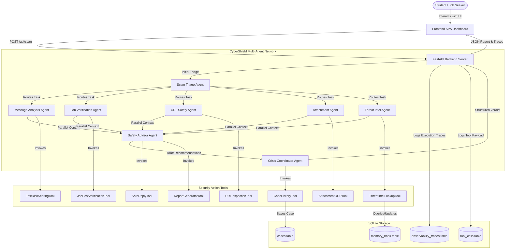
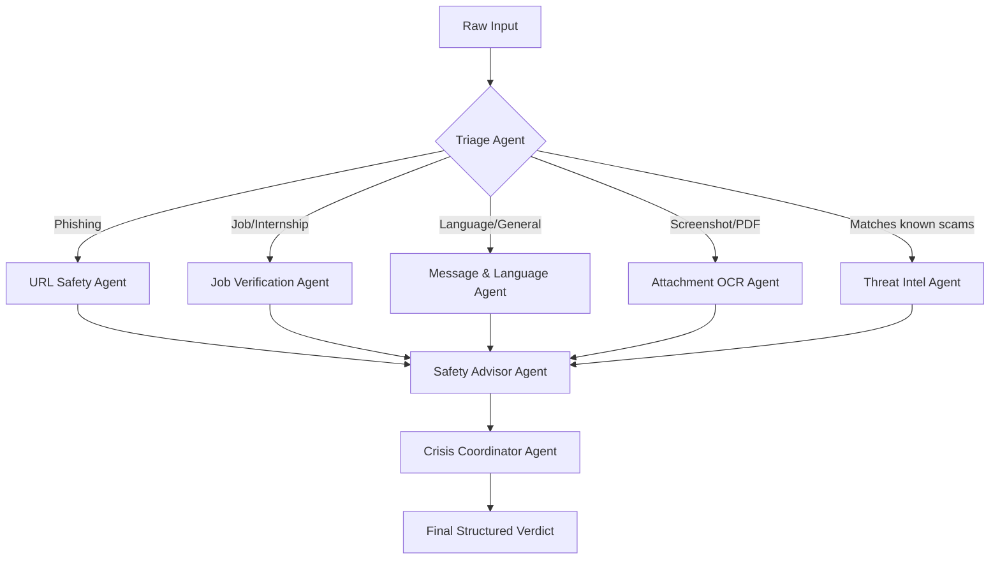
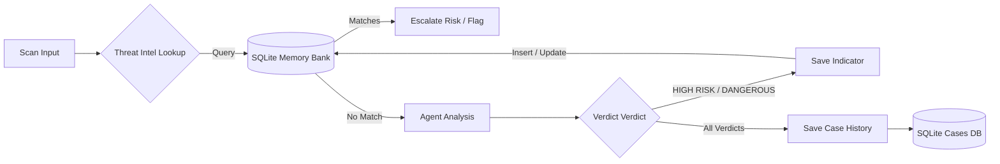
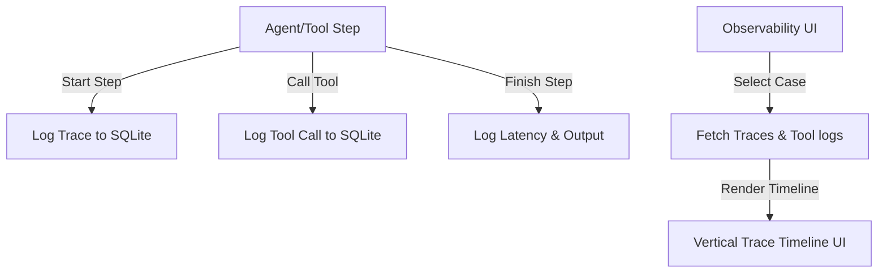
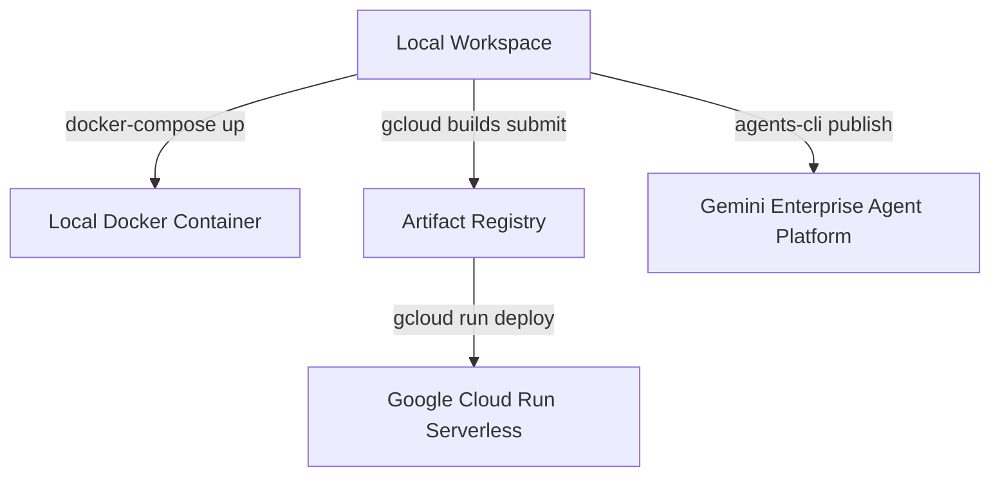

# 🛡️ CyberShield AI
### Student Scam & Fraud Protection Network
*Designed for the Kaggle AI Agents Intensive Capstone*

---

## 📝 1. Problem Statement & Motivation
Students, job seekers, and freshers are increasingly targeted by highly sophisticated scams. These range from **fake work-from-home internships** and **scholarship frauds** to **account phishing** and **impersonation attacks**. Often, these scams use urgency tricks, high rewards, or compliance fear tactics. 

Non-technical users need an instant, simple, and automated safety check before they click links or transfer registration deposits. **CyberShield AI** acts as a multi-agent security analyst network that scans suspicious text, URLs, and screenshots to deliver a clear security verdict, detailed evidence, and actionable safety advisories.

---

## 🛠️ 2. Key Course Concepts Demonstrated
CyberShield AI is built as a complete agent platform illustrating 7 core concepts from the Kaggle AI Agents Intensive Course:
1. **Multi-Agent Architecture**: 8 specialized agents communicating context.
2. **Sequential & Parallel Workflows**: Scam triage routes tasks, specialists run parallel evaluations, and findings aggregate sequentially in the coordinator.
3. **Custom Tools**: 8 custom tools for text risk scoring, domain verification, OCR, threat lookup, report layout, and database historical lookups.
4. **Long-Term Memory Bank**: Remembers repeated scam indicators (phishing domains, scammer phone numbers) across user sessions.
5. **Observability & Tracing**: Step-by-step trace logs, latency counters, and tool payloads persisted in SQLite and displayed visually.
6. **Agent Evaluation Pipeline**: Visual pass/fail metrics dashboard measuring accuracy, classification speed, and explanation quality against standard test suites.
7. **Production Containerization**: Multi-stage Docker configurations, local compose networks, and production Cloud Run guidelines.

---

## 📐 3. System Architecture & Diagrams

### Overall Architecture


### Multi-Agent Flow


### Memory & Threat Intel Flow


### Observability Trace Flow


### Deployment Flow


---

## 📦 4. Custom Tools Reference

The agents utilize 8 customized tools to scan input details:
1. **URLInspectionTool**: Extracts domains, handles shortened redirect links (e.g. bit.ly), checks typosquatting lookalikes, and flags IP-based host URLs.
2. **TextRiskScoringTool**: Evaluates text message urgency, reward bait keywords (e.g. cash win, select), and pressure tactics.
3. **JobPostVerificationTool**: Checks job listings for advance recruitment fees, unofficial recruiters (e.g., matching corporate brand with standard gmail.com sender), and suspicious WhatsApp interviewing redirects.
4. **AttachmentOCRTool**: Parses text from uploaded banners, screenshots, or posters.
5. **ThreatIntelLookupTool**: Matches details against a local threat intelligence memory bank database.
6. **ReportGeneratorTool**: Drafts professional Markdown Incident Reports suitable for placement cells or security officers.
7. **SafeReplyTool**: Compiles polite copy-paste rejection letters, helping students decline deposit demands safely.
8. **CaseHistoryTool**: Interfaces SQLite database to save user cases and lookup repeat scammers.

---

## 💾 5. Database Schema & Memory Design

CyberShield AI uses an **SQLite database** (`cybershield_db.sqlite`) to store structures:
- `cases`: Storing raw scanner submissions, computed scores, evidence arrays, next steps, and generated reports.
- `memory_bank`: Long-term memory tracking bad phone numbers, domain listings, and spammer handles.
- `observability_traces`: Agent workflow step logs, outputs, and execution millisecond speeds.
- `tool_calls`: Log tracking parameters and outputs of tool invocations.

---

## ⚡ 6. Setup & Local Execution

### Step 1: Install Dependencies
Run from the project root:
```bash
uv sync
```
*Alternatively, install via pip:*
```bash
pip install -r requirements.txt
```

### Step 2: Initialize Database
Seed default threat indicators:
```bash
uv run python -c "from app.memory.database import init_db; init_db()"
```

### Step 3: Run the Server
Start the Uvicorn web server locally:
```bash
uv run python -m uvicorn app.fast_api_app:app --host 0.0.0.0 --port 8000
```
Open `http://localhost:8000` to interact with the dashboard.

---

## 🐳 7. Docker & Containerized Running

To run local containers via Docker Compose:
1. Create a `.env` file containing your configurations:
   ```bash
   cp .env.example .env
   ```
2. Build and run containers:
   ```bash
   docker-compose up --build
   ```
This exposes the web dashboard on port `8000` and creates a local docker volume to persist database records.

---

## 🔬 8. Quality Evaluations Panel

You can run evaluations through two mechanisms:
1. **Interactive Evaluation Dashboard**: Navigate to the **Admin & Eval** tab in the web interface and click **Run Agent Eval Suite**. The app scans 8 standard test cases and outputs real-time accuracy and latency summaries.
2. **CLI Evaluation Suite**: Execute ADK eval checks directly:
   ```bash
   agents-cli eval dataset synthesize
   agents-cli eval run
   ```

---

## 🎯 9. Kaggle Capstone Submission Notes
- **Modular Layout**: All agent code is contained within the `app/` directory (`app/agents/`, `app/tools/`, `app/memory/`).
- **GCP Ready**: Fully configured to run using standard API keys or Vertex AI Agent Runtime out-of-the-box.
- **Observability Data**: Detailed decision paths are preserved, demonstrating transparency and security compliance.
