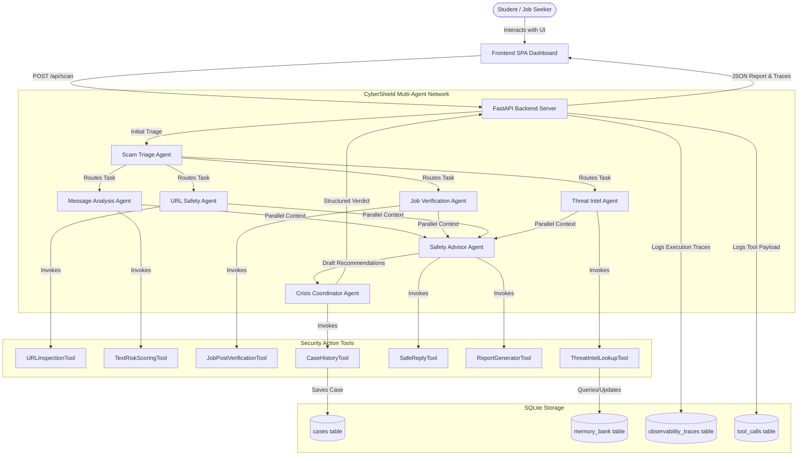
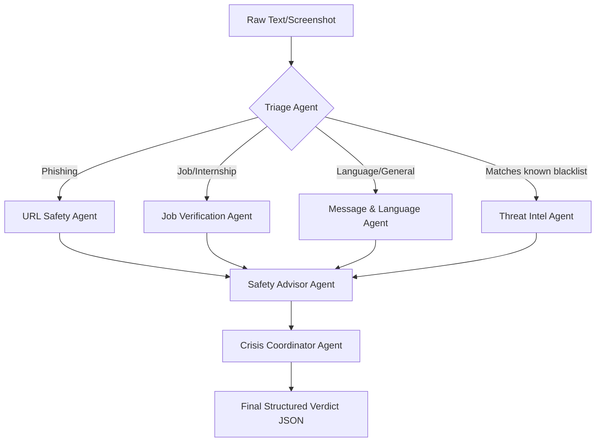

# 🛡️ CyberShield AI: Student Scam & Fraud Protection Network

[](https://www.kaggle.com)
[](https://fastapi.tiangolo.com)
[](https://www.python.org)
[](https://deepmind.google/technologies/gemini/)
[](https://www.sqlite.org)

An advanced, production-grade **Multi-Agent Security Pipeline** built after attending the **Kaggle x Google AI Agents Intensive** course to demonstrate the practical application of agentic engineering. CyberShield AI is built from the ground up using my own knowledge to shield students and freshers from recruiting fraud, fake internships, scholarship scams, and credential phishing.

---

## 🚀 Executive Summary & Architecture Highlights

CyberShield AI goes beyond mock endpoints. It is a fully functional web dashboard running a **hybrid execution engine** that chains specialized LLM security agents with rule-based fallbacks. It features:
* **Production-Grade Security:** Replaced basic client-side authentication with server-side passcode token handshakes, preventing web console bypasses.
* **True Multi-Agent Orchestration:** Formulated a complete Google ADK `SequentialAgent` workflow pipeline (`pipeline_agent`) that propagates session state across specialists and terminates in a structured coordinator.
* **Multimodal Vision OCR:** Implemented real-time image scan processing using `gemini-2.5-flash` to read text directly from uploaded job flyers and whatsapp chat screenshots, falling back to simulated templates for offline testing.

---

## 🛠️ Key Technical Competencies Demonstrated

### 1. Multi-Agent System Design (Google ADK)
Chains seven specialized agents with distinct prompts, system constraints, and tools:
* **Triage Agent:** Categorizes inputs (phishing, fake job, fake internship, scholarship, payment fraud, etc.) and routes tasks.
* **Message & Language Agent:** Inspects urgency indicators, reward bait, spelling patterns, and fear-tactic triggers.
* **Job/Internship Agent:** Evaluates recruitment guidelines, searching for upfront deposit anomalies and unofficial domains.
* **URL Safety Agent:** Performs typosquatting checks (base domain distance checking), shortened-link resolution, and IP checks.
* **Threat Intel Agent:** Logs and queries repeat offenders, syncing domains and contacts dynamically.
* **Safety Advisor Agent:** Compiles custom, copy-paste refusal replies and university placement incident reports.
* **Crisis Coordinator Agent:** Aggregates specialist state logs and outputs structured verdicts conforming to a strict **Pydantic schema**.

### 2. Full-Stack API Engineering
* **Backend:** Built with FastAPI, utilizing asynchronous execution contexts to run the ADK runner natively on parallel threads.
* **Frontend:** Developed a sleek, high-contrast digital safety dashboard designed like a government security portal (similar to cybercrime.gov.in) with responsive visual timeline trace observability.

---

## 📐 System Design & Workflows

### Multi-Agent Pipeline & Data Flow


### Incident Verdict State Machine


---

## 💾 Observability & Trace Logging Database Schema

All scans, agent actions, tool payloads, and latency tracking are recorded inside an SQLite database (`cybershield_db.sqlite`):
* `cases`: Stores user submissions, computed risk scores, extracted evidence lists, and generated report templates.
* `memory_bank`: Long-term memory bank storing blacklisted domains, spam phone numbers, and emails to block.
* `observability_traces`: Records timestamp, executing agent name, status (`RUNNING`, `DONE`), step details, and latency (ms).
* `tool_calls`: Tracks exact tool inputs and output JSON dictionaries for inspection.

---

## ⚡ Setup & Local Execution

Get the project running on your local machine in under 3 minutes:

### 1. Install Dependencies
Ensure you have `uv` or `pip` installed:
```bash
uv sync
# OR
pip install -r requirements.txt
```

### 2. Initialize the Database
Seed default threat lists and initialize the tables:
```bash
uv run python -c "from app.memory.database import init_db; init_db()"
```

### 3. Run the Server
Start the Uvicorn FastAPI application:
```bash
uv run python -m uvicorn app.fast_api_app:app --host 0.0.0.0 --port 8000
```
Open `http://localhost:8000` in your browser to view the interactive dashboard.

---

## 🔬 Quality Evaluation Suite
Demonstrates compliance with the quality flywheel of agent engineering.
* **Synthesize Dataset:** `agents-cli eval dataset synthesize` to produce standard evaluation arrays.
* **Run CLI Evaluations:** Run `agents-cli eval run` to measure classification latency and decision boundary accuracy.
* **Visual Evaluation Panel:** Click **Run Agent Eval Suite** under the web dashboard's **Admin Mode** to check performance targets.

---

## ⚖️ License & Copyright

**© 2026 Shailly Bhardwaj. All Rights Reserved.**

This repository and all of its contents (source code, assets, UI layouts, diagrams) are private and proprietary. No portion of this project may be copied, cloned, reproduced, redistributed, or used in any manner without the explicit prior written permission of the author.

*Additional deployment guides, corporate integrations, and project details will be added to this repository soon.*
