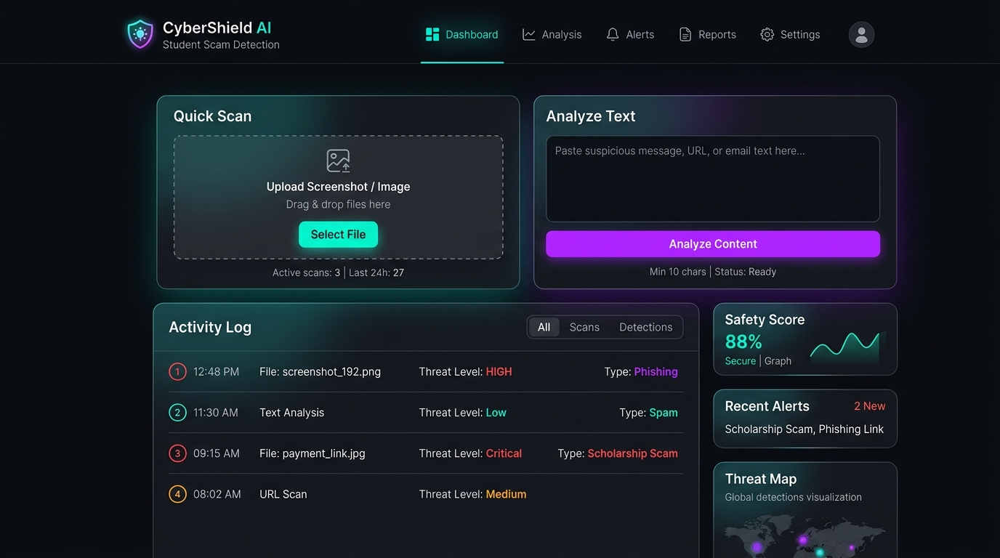
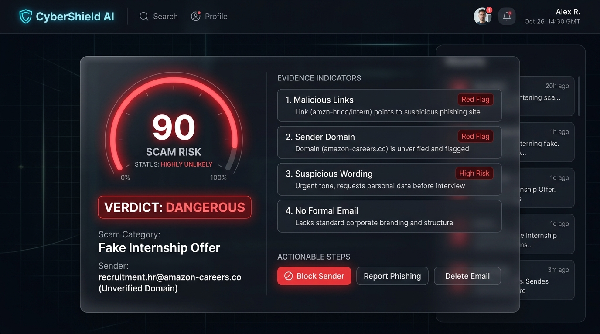
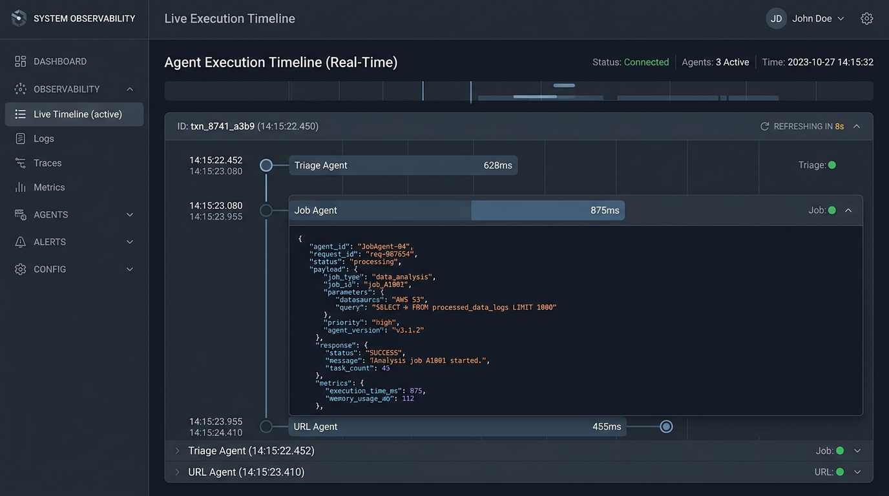
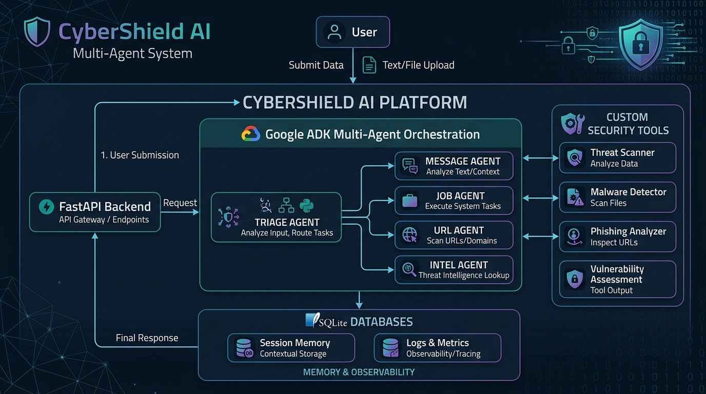

<p align="center">
  
</p>

<h1 align="center">🛡️ CyberShield AI</h1>
<p align="center">
  <strong>AI-powered multi-agent cybersecurity platform that protects students from phishing, fake internships, scholarship fraud, and recruitment scams.</strong>
</p>

<p align="center">
  <a href="https://cybershield-ai-84fb.onrender.com/"></a>
  
  
</p>

---

## 🔗 Live Deployment
*   **Demo Portal:** [https://cybershield-ai-84fb.onrender.com/](https://cybershield-ai-84fb.onrender.com/)
*   **GitHub Repository:** [https://github.com/shaillybhardwaj123/cybershield-ai](https://github.com/shaillybhardwaj123/cybershield-ai)

---

## 🖼️ Screenshots & UI Showcase

### 1. Dashboard Home
*Landing portal displaying scanning inputs and configuration cards.*


### 2. Scam Detection Result
*Verdict view showcasing risk gauge results and parsed indicator evidence.*


### 3. Observability Timeline
*Timeline visualizer displaying latencies and trace payloads.*


---

## 💡 Project Overview
CyberShield AI is an autonomous, production-grade **Multi-Agent Security Pipeline** built using the **Google Agent Development Kit (ADK)** and the Gemini model family. It acts as a personal security analyst for students, helping them verify recruitment offers, scholarship opportunities, and messaging threads before they become victims of cybercrime.

Every year, thousands of students lose money, credentials, and career opportunities to fake internships, scholarship scams, phishing campaigns, and impersonation attacks.

---

## 1. Problem Statement
The transition from college to the professional world is a high-vulnerability window for fresh graduates. Malicious actors leverage this to target academic placement systems and students directly via:
*   **Fake Internships & Jobs:** Offering high wages or stipends but requiring upfront "refundable" registration fees, training packages, or equipment deposits.
*   **Scholarship Fraud:** Promoting fake grants to harvest banking credentials or sensitive personal information.
*   **Credential Phishing:** Tricking students into logging in via lookalike domains (e.g., `placement-portal-g00gle.com`).
*   **Impersonation & Social Engineering:** Contacting students on messaging channels (Telegram, WhatsApp) pretending to be official university recruiters.

---

## 📐 Architecture
CyberShield AI integrates an asynchronous FastAPI backend with a multi-agent orchestration pipeline.



### Core Telemetry & DB Schema
All operations, latencies, and tool variables are tracked in a local SQLite database containing:
*   `cases`: Log of investigated incidents, evidence arrays, and safety recommendations.
*   `memory_bank`: Locally cached threat indicators (domain, email, phone number) updated in real-time when dangerous verdicts are issued.
*   `observability_traces`: Latency profiles and step-by-step agent statuses.

---

## 🤖 Agent Responsibility Matrix

The system splits security logic among multiple specialized agents built on the **Google ADK** framework:

| Agent | Responsibility | Key Security Actions |
| :--- | :--- | :--- |
| **Triage Agent** | Scam classification | Parses input text to identify potential scam categories and dynamically route to downstream agents. |
| **URL Agent** | Link verification | Inspects domains for lookalike patterns (typosquatting) and suspicious TLDs. |
| **Job Agent** | Recruitment analysis | Audits recruitment details, detecting advance fee requests or unofficial channels. |
| **Message Agent** | Language risk analysis | Scores wording pressure tactics, urgency markers, and coercion vectors. |
| **Intel Agent** | Threat intelligence | Queries local SQLite blacklists for flagged emails, phone numbers, and domains. |
| **Coordinator Agent** | Final verdict | Aggregates all specialists' findings, calculates final risk scores, and compiles verdict. |
| **Advisor Agent** | Recommendations | Generates copy-paste safe reply templates and authority incident report markdown. |

---

## 🔄 Multi-Agent Workflow

```
       User Input
           │
           ▼
     Triage Agent
           │
           ▼
┌─────────────────────────────────────────────────────────┐
│  Message Agent ── URL Agent ── Job Agent ── Intel Agent │  (Parallel Analysis)
└─────────────────────────────────────────────────────────┘
           │
           ▼
   Coordinator Agent (Verdict & Score Engine)
           │
           ▼
     Advisor Agent   (Actionable Guidance)
           │
           ▼
     Final Verdict
```

1.  **Ingestion:** The system parses inputs and extracts text from attachments using `attachment_ocr_tool`.
2.  **Triage Routing:** The `triage_agent` analyzes the content, defines the scam category, and loads corresponding specialists.
3.  **Parallel Specialist Evaluation:**
    *   `message_agent`: Invokes `text_risk_scoring_tool` to check urgency markers and pressure vectors.
    *   `job_agent`: Runs `job_post_verification_tool` to look for advance payment cues.
    *   `url_agent`: Invokes `url_inspection_tool` to check typosquatting and base domain records.
    *   `intel_agent`: Queries the local SQLite blacklist database using `threat_intel_lookup_tool`.
4.  **Advisory Assembly:** The `advisor_agent` constructs action checklists and safe reply refusal scripts.
5.  **Reconciliation:** The `coordinator_agent` merges inputs, evaluates evidence, computes the final risk score, and maps it to a strict Pydantic output schema (`CyberShieldVerdict`).

---

## ✨ Features
*   **Autonomous Multi-Agent Orchestration:** Integrates the Google ADK to organize multiple specialized agents into a unified, stateful `SequentialAgent` workflow.
*   **Server-Side Security Enforcement:** Features robust server-side token handshakes to validate access to administrative dashboards, eliminating client-side inspector bypasses.
*   **Multimodal Vision Scanning:** Employs Gemini to run real-time Vision OCR on screenshots, chat transcripts, and flyers, extracting threat vectors dynamically.
*   **Observability & Trace Logs:** Every execution step, latency cost, and tool output is logged sequentially to a local database and rendered on a timeline.

---

## 🛠️ Tech Stack & Implementation
*   **Frameworks:** FastAPI (Python), Vanilla HTML5, CSS3, & Modern JS.
*   **Agent SDK:** Google Agent Development Kit (ADK) (`Agent`, `SequentialAgent`, `ParallelAgent`).
*   **LLM Model:** Gemini model family (Vertex AI / Google AI SDK).
*   **Database:** SQLite (telemetry logs, threat memory bank, audit traces).
*   **Containerization:** Docker & Docker-Compose.

---

## ⚡ Setup & Local Execution

### 1. Install Dependencies
Ensure you have `uv` or standard pip installed:
```bash
uv sync
# OR
pip install -r requirements.txt
```

### 2. Initialize Database
Initialize the SQLite schema and seed default blacklist indicators:
```bash
uv run python -c "from app.memory.database import init_db; init_db()"
```

### 3. Run FastAPI Application
```bash
uv run python -m uvicorn app.fast_api_app:app --host 0.0.0.0 --port 8000
```
Open `http://localhost:8000` in your browser.

---

## 🔬 Observability & Quality Evaluations
*   **CLI Synthesizer:** Execute `agents-cli eval dataset synthesize` to produce standard evaluation dataset files.
*   **CLI Evaluator:** Run `agents-cli eval run` to measure classification speed and boundary accuracy targets.
*   **Interactive Panel:** Click **Run Agent Eval Suite** inside the **Admin Mode** tab on the web UI to verify accuracy scores live.

---

## 🔮 Future Improvements
1.  **Vector Embeddings for Semantic Scam Matching:** Represent incoming text structures as high-dimensional vectors and compare them against a vector database of historic scams to detect mutational templates.
2.  **Federated Blacklist Sharing:** Establish anonymous P2P sharing of discovered threat indicators across multiple campus nodes.
3.  **Agentic Interactive Sidecars:** Launch sandboxed agent sidecars that automatically interact with suspicious recruiters via email/chat, probing them for credentials to gather solid evidence without exposing the user.
4.  **In-App / Extension Scanning Hooks:** Build browser plugins to scan messages on Gmail or WhatsApp Web directly with a single click.

---

## ⚖️ License
Licensed under the MIT License - see the [LICENSE](LICENSE) file for details.
