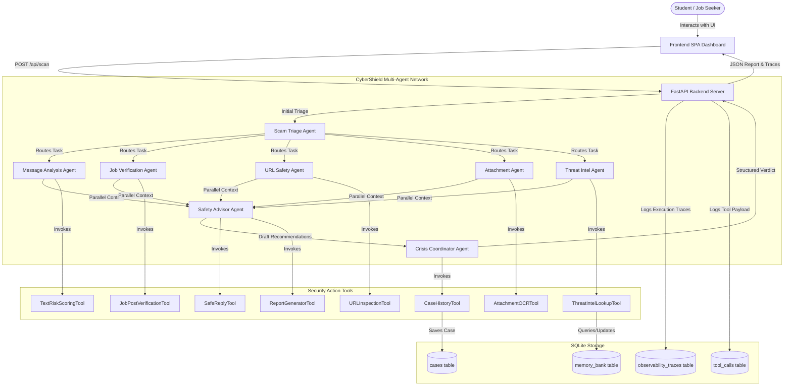

# 🛡️ CyberShield AI: Architecture Design

This document details the system design, multi-agent orchestrations, memory layout, and observability flow of **CyberShield AI: Student Scam & Fraud Protection Network**.

---

## 1. Overall System Architecture

The system utilizes a client-server architecture. The backend is built using **Google ADK (Agent Development Kit)** and **FastAPI**, backed by a local **SQLite database** that maintains case logs, long-term memory indicators, and observability traces. The frontend is a modern dark-mode single-page dashboard serving HTML/CSS/JS.

---

## 2. Multi-Agent Workflow Sequence

The workflow combines **sequential triage** with **parallel specialist execution** to maximize analysis speed and accuracy:

1. **Scam Triage Agent** inspects the incoming request, categorizes it, and decides which specialists to activate.
2. **Specialist Agents** run in parallel:
   - **Message & Language Agent** uses `TextRiskScoringTool` to flag urgency, fear vectors, and bait patterns.
   - **Job / Internship Agent** uses `JobPostVerificationTool` to identify recruitment fee patterns, channel redirects, and stipend bait.
   - **URL / Website Agent** uses `URLInspectionTool` to check typosquatting, lookalike domains, and IP domains.
   - **Attachment Agent** uses `AttachmentOCRTool` to run visual scanning over screenshots or posters.
   - **Threat Intel Agent** uses `ThreatIntelLookupTool` to search known scams.
3. **Safety Advisor Agent** aggregates the outputs, creating custom reporting layouts and safe replies.
4. **Crisis Coordinator Agent** acts as the final judge, computing the aggregated risk score (0-100), assigning the verdict (SAFE, SUSPICIOUS, HIGH RISK, DANGEROUS), compiling the evidence, and signing off the incident response.

---

## 3. Memory & Long-Term Memory Bank Design

Cross-session learning is implemented using SQLite:
* **Session Memory**: Handled by passing context through the active pipeline and saving state in the `cases` table.
* **Long-Term Memory Bank**: The `memory_bank` table persists threat indicators (fraudulent phone numbers, phishing domains, suspicious emails). When high-risk cases are identified, the indicators are automatically added or updated in the memory bank to protect future scans.

---

## 4. Observability & Tracing Architecture

observability is natively integrated:
1. **Traces**: Every step of the agent pipeline logs its timestamp, status (RUNNING, DONE), latency in milliseconds, and structured output to the `observability_traces` table.
2. **Tool Logs**: Inputs and outputs for all custom tools are JSON-serialized and stored in the `tool_calls` table.
3. **Dashboard Ticker**: The admin page reads these tables to render real-time response latency, agent timelines, and active threat maps.
